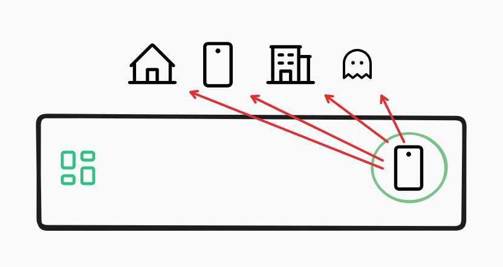
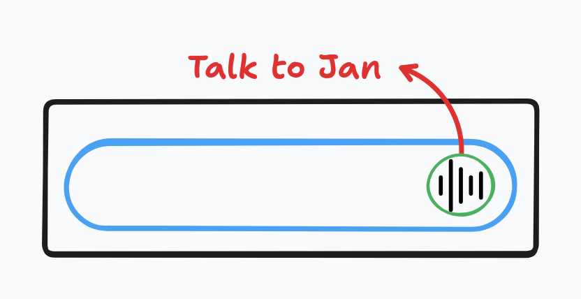
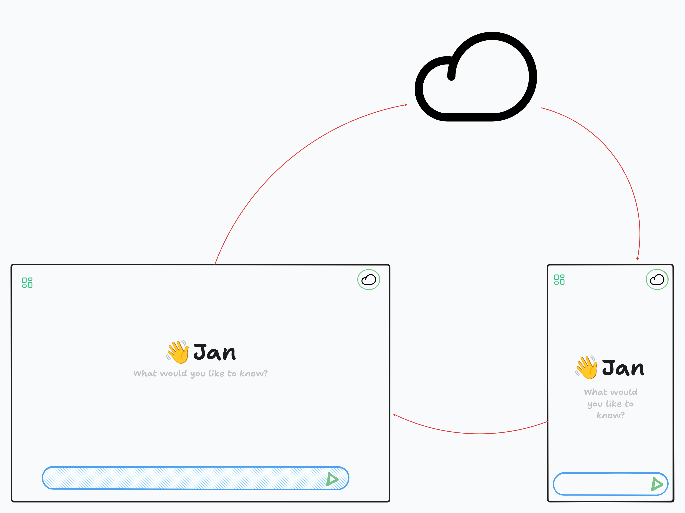

import { Aside, Card, CardGrid } from '@astrojs/starlight/components';

Jan Mobile brings the same AI experience to your phone. Connect to your desktop, your server, or run models locally.


<Aside type="note">
Coming Q4 2025. Sign up here to get a notification when it's available [Newsletter](https://jan.ai/mobile).
</Aside>

## How It Works

Jan Mobile adapts to your situation:

At Home, you can connect to your Jan Desktop over WiFi


At Work, you can connect to your company Jan Server


On the Go, you can run Jan Nano on your phone or talk to your favourite cloud-based model


**No configuration needed. It just works.**

## Three Modes, One Experience

### Desktop Mode
When you're near your computer at home, you an toggle  phone uses its models and processing power.

```
Your Phone → WiFi → Your Desktop → Response
             (automatic)  (powerful models)
```

**Benefits:**
- Access to larger models
- Faster processing
- Shared conversations
- No phone battery drain

### Server Mode
Connect to your organization's Jan Server for team collaboration.

```
Your Phone → Internet → Company Server → Response
             (secure)    (shared models)
```

**Benefits:**
- Team knowledge base
- Consistent models
- Central management
- Work anywhere

### Local Mode
No connection? No problem. Jan Nano runs directly on your phone.

```
Your Phone → Jan Nano (6GB) → Response
             (private & offline)
```

**Benefits:**
- Complete privacy
- Works offline
- No data usage
- Always available

<Aside type="tip">
The app automatically switches between modes based on what's available. You don't need to do anything.
</Aside>

## Key Features

<Card title="Seamless Switching" icon="random">
Move from home to office to airplane. One-click and Jan adapts immediately.


</Card>

<Card title="Voice First" icon="phone">
Talk to Jan naturally. Responses can be spoken too.


</Card>

<Card title="Sync Everything" icon="up-arrow">
Conversations, settings, and preferences follow you across devices.

</Card>

## Privacy & Security

### Your Data, Your Control
- Local Mode: Everything stays on your phone
- Desktop Mode: Direct encrypted connection
- Server Mode: Your organization's policies apply

### No Compromises
- Biometric app lock
- Encrypted storage
- No cloud backups without permission
- Clear data anytime

## Why Mobile Matters

Your phone is with you always. Your AI assistant should be too. But that doesn't mean sacrificing
privacy or control.

Jan Mobile proves you can have:
- Powerful AI anywhere
- Complete privacy when needed
- Simple experience always
- No subscriptions or tracking

## Coming Features

### Launch (Q4 2025)
- iOS and Android apps
- Basic chat interface
- Three connection modes

### Post-Launch
- voice input
- Background sync

<Aside type="note">
Jan Mobile uses Tauri for native performance with a small app size (~50MB).
</Aside>

## The Vision

Most mobile AI apps are just cloud wrappers. Jan Mobile is different:

| Feature | Other AI Apps | Jan Mobile |
|---------|---------------|------------|
| Offline Mode | ❌ | ✅ Jan Nano |
| Desktop Connection | ❌ | ✅ Your models |
| Privacy | Your data in cloud | Your data stays yours |
| Cost | Monthly subscription | Free with your hardware |

## While you wait for Jan Mobile:

1. **Set up Jan Desktop** - It will power your mobile experience
2. **Try jan.ai** - Get familiar with the interface
3. **Join our newsletter** - Be first to know when it launches
4. **Tell us what you need** - Shape the mobile experience
