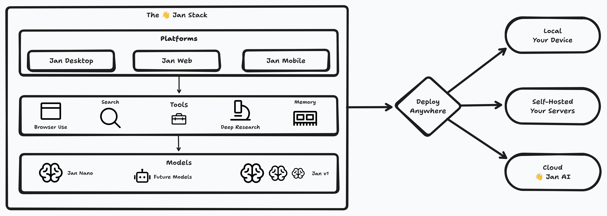

import { Aside, Card, CardGrid } from '@astrojs/starlight/components';

> **to build a superintelligence that you can self-host and use locally on your own devices.**

We know it's hard but we believe this will be possible in the next decade through a combination of
models, applications and tools. For this we are...

> **building Jan as the ecosystem that ties all of these seamlessly so that users, regardless of their technical
background, add intelligence to their day-to-day lives like they would, but better, with similar tools.**

## Core Principles

### 1) Build the Full Stack

Models alone aren't enough. Neither are applications. Superintelligence requires models that
understand your needs, tools that extend capabilities, and applications that tie it all
together. We're building all three, openly.

### 2) You Choose Who Runs It
Run Jan on your laptop. Self-host it on your servers. Use our cloud. The same superintelligence
works everywhere. Your data, your compute, your choice.

### 3) Start Simple, Scale Infinitely
Open Jan and start chatting. No setup required. When you need more - better models, advanced tools,
team deployment - everything's there. The complexity scales with your ambition, not our architecture.

## The Path to Superintelligence

### Today we have the Foundation

- **A desktop app** that works both with local and cloud-based models
- **Jan models** small enough to run on any laptop and powerful enough to scale on any server
- **Basic tools** enabled through MCP Search, file parsing, simple workflows

### Next 12 Months: Ecosystem
- **The Jan v1 models** are a specialized series of models with general capabilities but optimsed
for specific tasks like search, analysis, creative writing and more
- **The Jan server** works as a self-hosted AI infrastructure for teams
- **Advanced tools** like browser use, deep research, and long-term memory works across devices, excels
across different day-to-day use cases, and scales with the needs of large teams
- **Cross-device sync** allows you to take your AI everywhere

### End State: Open Superintelligence
Not one massive model, but an ecosystem of specialized models, tools, and applications working
together. Built in public. Owned by whoever runs it.

## Why This Matters: The Status Quo

Every other AI company wants to be your AI provider. We want you to own your AI.

- **OpenAI/Anthropic**: Their models, their servers, their rules
- **Open Source Models**: Powerful but fragmented - no cohesive experience
- **Jan**: Complete ecosystem you can own, modify, and deploy however you want

## Watch Us Build

### Live Model Training
We train our models in public. Check the [models page](./models/jan-v1) to see:
- Real-time training progress
- Failed runs and what went wrong
- Models in testing before release

No "trust us, it's good." Watch the entire process from dataset to deployment.

### Help Evaluate Our Models
Every model needs real-world testing. Join our open evaluation platform where you can:
- Compare model outputs side-by-side
- Test specific capabilities you care about
- Vote on which responses actually help
- Suggest improvements based on your use cases

Think LMArena, but you can see all the data, run your own evals, and directly influence what we train next.

[Test/evaluate our models here](link)

### Our Models Training Right Now

We don't just talk about open development. Here's what's actually happening:

| Model | Progress | Status | Details |
|:------|:---------|:-------|:--------|
| **Jan-Search-7B** | ████████░░ 82% | Testing | [View run](/) • 2.1M steps • ETA 3 days |
| **Jan-Write-13B** | ████░░░░░░ 41% | Training | [View run](/) • 980K steps • On track |
| **Jan-Analyze-13B** | ████████░░ ~~67%~~ | Failed | [View logs](/) • OOM at step 1.5M • Restarting |

These are our actual models training on our hardware in our Singapore office. Click any run to see:
- Live loss curves
- Training datasets
- Evaluation metrics
- Even our failures

[Watch live training →](/train)

## Get Involved

We build in public. Everything from our model training to our product roadmap is open.

- [GitHub](link) - Contribute code
- [Handbook](link) - See how we train models
- [Discord](link) - Join the discussion
