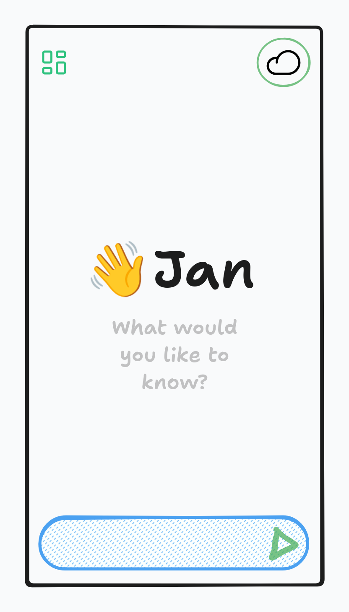

import { Aside, Card, CardGrid } from '@astrojs/starlight/components';

**Status:** Coming Q4 2025

Jan Mobile brings the same AI experience to your phone. Connect to your desktop, your server, or run models locally.

## How It Works

Jan Mobile adapts to your situation:
-   **At Home:** Connect to your Jan Desktop over WiFi.
-   **At Work:** Connect to your company Jan Server.
-   **On the Go:** Run Jan Nano on your phone or use a cloud model.

## Three Modes, One Experience

### Desktop Mode
Access larger, more powerful models running on your home computer. No phone battery drain.

### Server Mode
Connect to your organization's private AI cloud for team collaboration and access to shared knowledge.

### Local Mode
No connection? No problem. Run models like 'Jan Nano' directly on your phone for complete privacy and offline access.

## Key Features

<CardGrid>
    <Card title="Seamless Switching" icon="random" />
    <Card title="Voice First Interface" icon="microphone" />
    <Card title="Sync Everything" icon="sync" />
    <Card title="iOS and Android" icon="mobile" />
    <Card title="Adaptive Modes" icon="adjustments" />
    <Card title="Jan Models Integration" icon="puzzle" />
</CardGrid>

## Development Status
-   Core architecture in progress
-   Desktop/Server connection protocols next
-   Jan Nano mobile optimization in progress
-   Beta launch planned for Q4 2025