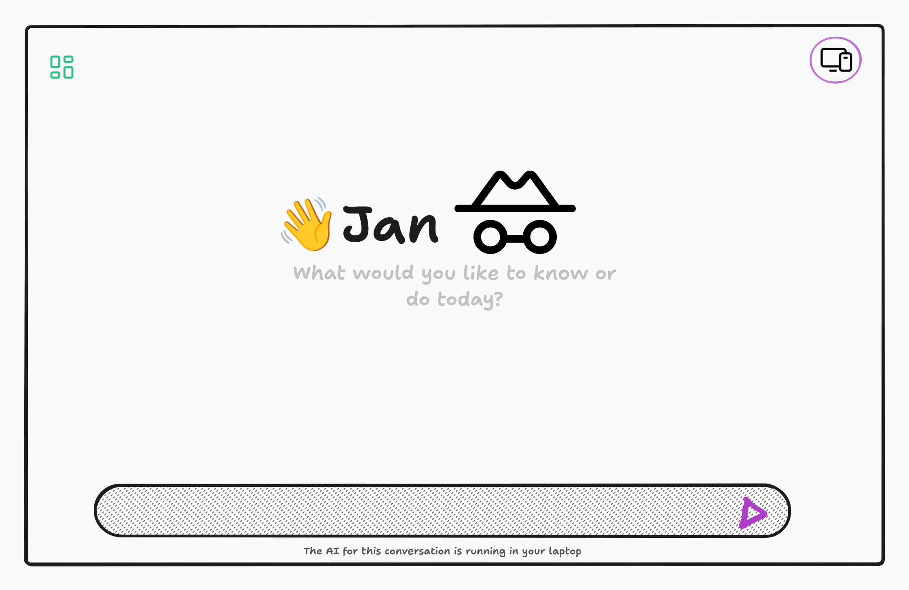
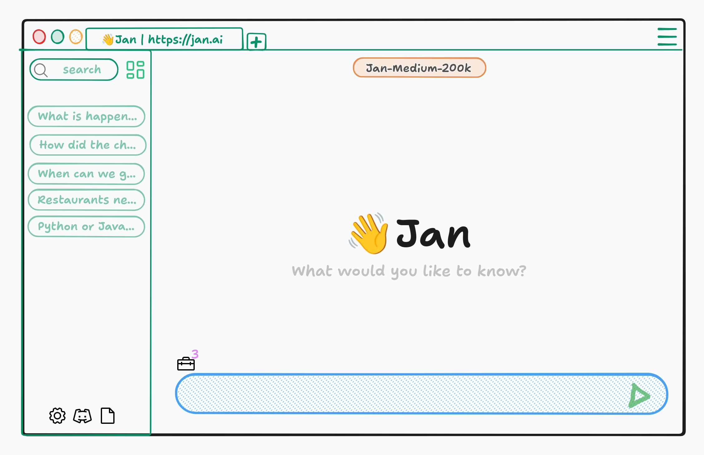
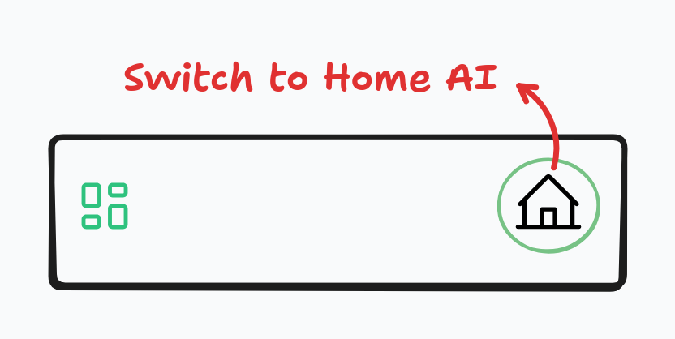
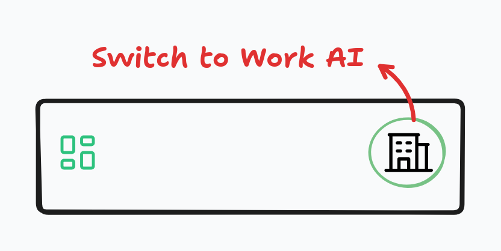

import SimpleFloatingNav from '../components/SimpleFloatingNav.astro';
import SimpleTOC from '../components/SimpleTOC.astro';
import ReleaseDatabase from '../components/ReleaseDatabase.astro';

<SimpleFloatingNav currentPage="products" />
<SimpleTOC />

# Products

Jan is moving from a local AI application to a complete full-stack AI solution that you can self-host. This includes models,
applications, and tools that delights users and help them solve their problems.

## What We're Building

**Jan Factory (or Agent)** = Jan Models + Jan Application + Jan Tools

Unlike other AI assistants that do specific tasks with one model or have many models with a myriad of solutions, Jan provides:
- Its own specialised models that are optimised at specific tasks like web-search, creative writing, and translation
- Applications that work across all of your devices in an integrated way
- Tools that actually get things done

## Two Modes, One Experience

### Local (Incognito) Mode

Run AI models entirely on your device, giving you complete privacy with no internet required.

### Cloud Mode

Connect to more powerful models when needed - either self-hosted or via jan.ai.

Users shouldn't need to understand models, APIs, or technical details. Just choose Local for privacy or Cloud for power.

## Our Product Principles

### 1) It Just Works

1. Open Jan, start chatting
2. Onboarding is fully available but optional
3. Setting up an API key is optional
4. Selecting a local model is optional
5. Become a power user at your own pace, if you want to

We handle the complexity.

### 2) Cloud When Needed

Start completely locally and own your AI models. Add cloud capabilities only when you choose to.

### 3) Solve Problems, Not Settings

We help users get to answers quickly answers, not configuration options. Power users can dig deeper, but it's never required.

## Available on Every Device

### Jan Desktop

This is how Jan started and it has been available since day 1. Jan Desktop stives to be:

> Your personal AI workstation that helps with our use cases and powers other devices. Run models locally right away
or bring an API key to connect to your favorite cloud-based models.

**Key Features:**
- Runs models locally on your hardware
- GPU acceleration support
- Powers other devices via network connection
- Complete privacy and control
- Windows, macOS, and Linux support

**Requirements:**
- Minimum 8GB RAM
- 10GB+ storage space
- Optional: NVIDIA GPU for acceleration

### Jan Web

**Status:** Beta Launch Soon

Web-based version of 👋 Jan with no setup required. Same default cloud mode for mobile and desktop users.

**Key Features:**
- No installation needed
- Instant access from any browser
- Automatic updates and maintenance
- Default cloud backend for mobile apps
- Team collaboration features
  - Share prompts
  - Share workflows
  - Collaborate on threads

**Pricing:**
- Free for everyone
- Pro:
  - Access our latest models
  - Access other cloud providers, no need to bring their API keys
- Enterprise:
  - Self-host or we host it for you
  - Active support and SLAs
  - SSO
  - Team featues

### Jan Mobile

**Status:** Coming Q4 2025

Connect to Desktop/Server, run local mode with Jan Nano or Lucy, same experience everywhere.

Jan Mobile adapts to your situation:

At Home, you can connect to your Jan Desktop over WiFi

At Work, you can connect to your company Jan Server

On the Go, you can run Jan Nano on your phone or talk to your favourite cloud-based model

**Key Features:**
- iOS and Android support
- Three adaptive modes (Desktop, Server, Local)
- Voice-first interface
- Seamless device switching
- Jan Nano for on-device AI

### Jan Server

**Status:** Coming Q2 2025

Self-hosted solution for teams and enterprises. Your own private AI cloud.

**Key Features:**
- Support for 5-500+ concurrent users
- Enterprise authentication (SSO, LDAP)
- Docker and Kubernetes deployment
- Admin dashboard
- Team knowledge sharing

**Deployment Options:**
- Docker: Single command setup
- Kubernetes: Enterprise scale
- Bare metal: Maximum control

## Jan Mobile: Three Modes, One Experience

Jan Mobile brings the same AI experience to your phone. Connect to your desktop, your server, or run models locally.

### How It Works

Jan Mobile adapts to your situation:

**At Home** - Connect to your Jan Desktop over WiFi
Your Phone → WiFi → Your Desktop → Response

**At Work** - Connect to your company Jan Server
Your Phone → Internet → Company Server → Response

**On the Go** - Run Jan Nano on your phone or talk to your favorite cloud-based model
Your Phone → Jan Nano (6GB) → Response

No configuration needed. It just works.

### Key Features

- **Seamless Switching**: Move from home to office to airplane. One-click and Jan adapts immediately.
- **Voice First**: Talk to Jan naturally. Responses can be spoken too.
- **Sync Everything**: Conversations, settings, and preferences follow you across devices.

### Privacy & Security

**Your Data, Your Control**
- Local Mode: Everything stays on your phone
- Desktop Mode: Direct encrypted connection
- Server Mode: Your organization's policies apply

**No Compromises**
- Biometric app lock
- Encrypted storage
- No cloud backups without permission
- Clear data anytime

## What Makes Jan Different

<table className="simple-table">
  <thead>
    <tr>
      <th>Feature</th>
      <th>Other AI Assistants</th>
      <th>Jan</th>
    </tr>
  </thead>
  <tbody>
    <tr>
      <td>Models</td>
      <td>Wrapper around Claude/GPT</td>
      <td>Our own models + You can own them</td>
    </tr>
    <tr>
      <td>Dual mode</td>
      <td>Your data on their servers</td>
      <td>Your data stays yours</td>
    </tr>
    <tr>
      <td>Deployment</td>
      <td>Cloud only</td>
      <td>Local, self-hosted, or cloud</td>
    </tr>
    <tr>
      <td>Cost</td>
      <td>Subscription forever</td>
      <td>Free locally, pay for cloud</td>
    </tr>
  </tbody>
</table>

## Development Timeline

<ReleaseDatabase />

